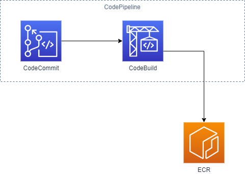
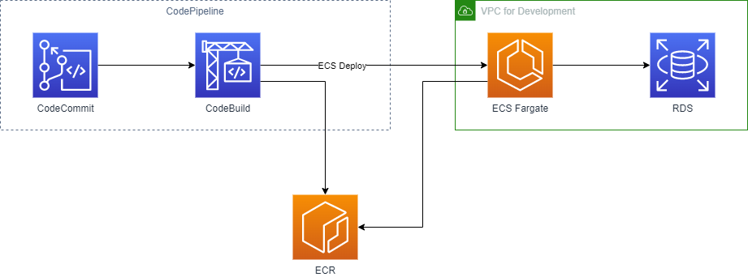
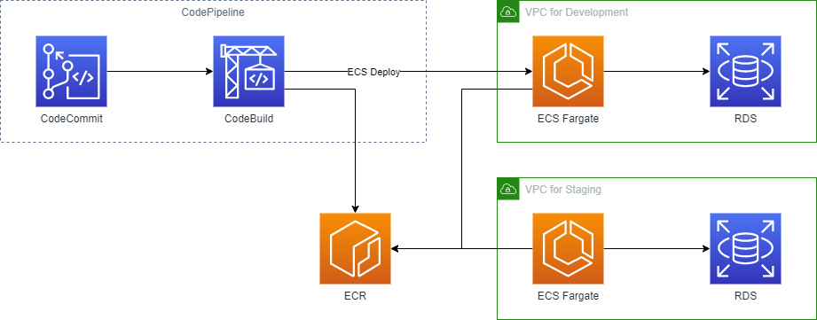
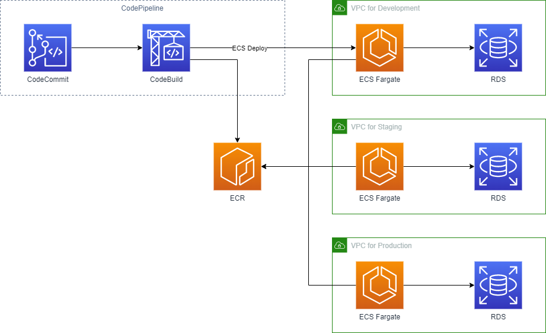

# ECS Application

開発の進行に合わせてリソースを作成していきます。

1. **開発着手** - ソースコード管理用のリポジトリとコンテナイメージ登録用の CI/CD 及びイメージリポジトリを作成します
1. **開発動作検証** - 開発用の ECS 環境及び DB をし、 CI/CD にデプロイアクションを追加します
1. **ステージング動作検証** - ステージング用の ECS 環境及び DB を追加します
1. **本番動作検証** - 本番用の ECS 環境及び DB を追加します

デフォルトの設定では環境毎に以下のような構成の違いがあります。
これらは [config.json](#configuration) を記述することで変更できます。

|                       | 開発              | ステージング      | 本番    |
| --------------------- | ----------------- | ----------------- | ------- |
| RDS                   | Aurora Serverless | Aurora Serverless | Aurora  |
| ECS Capacity Provider | Fargate Spot      | Fargate Spot      | Fargate |
| Backup                | No                | No                | Yes     |
| CloudWatch Alarm      | No                | No                | Yes     |

## Construct

構成はステップ毎に以下のようなリソースを作成します。
(ECS, RDS 等については詳細な作成リソースの記述は省略してある。)

### Step 1 (`INIT`)

開発初期ステップとして CodeCommit リポジトリとそこから ECR リポジトリへのイメージ登録までのパイプラインを作成します。

アプリケーションコードの作成とともに `buildspec.yml` を作成し、コンテナイメージの登録を行います。

### Step 2 (`DEV`)

アプリケーションがある程度作成できたタイミングで開発用の動作環境を作成します。
この開発用 ECS 環境はパイプラインにより最新のイメージが常にデプロイされるように構成されます。

### Step 3 (`STG`)

アプリケーションがある程度完成したタイミングでステージング環境を作成します。
ステージング用 ECS 環境の参照イメージは手動で更新する必要があります。

### Step 4 (`PRD`)

リリースのために本番環境を作成します。
本番用 ECS 環境の参照イメージは手動で更新する必要があります。

## Configuration

### Common

- `applicationName`
  - アプリケーション名
  - リポジトリ名等に利用されます
  - 必須 - Yes
  - タイプ - String
- `deployStep`
  - 作成する構成のステップ
  - 構成をどこまで作成するかを指定します
  - 必須 - Yes
  - 指定可能な値 - `INIT`, `DEV`, `STG`, `PRD`
- `buildTargetName`
  - CI/CD の対象とするブランチ名
  - CodePipeline の実行対象となるブランチ名を指定します
  - 必須 - Yes
  - タイプ - String
- `imageTagMutability`
  - コンテナイメージタグの可変性
  - 同一タグ名の登録を許可するか指定します
  - 必須 - Yes
  - タイプ - Boolean
- `stageConfig`
  - 環境毎の設定
  - 必須 - Yes
  - タイプ - Object
  - キーの値 - `development`, `staging`, `production`

### RDS

- `stageConfig.{STAGE}.rds.databaseName`
  - データベース名
  - MySQL 内に作成するデータベース名 (RDS クラスター名ではない)
  - 必須 - Yes
  - タイプ - String
- `stageConfig.{STAGE}.rds.engineVersion`
  - Aurora MySQL エンジンバージョン
  - 必須 - Yes
  - タイプ - String
- `stageConfig.{STAGE}.rds.parameters`
  - RDS パラメーターグループ
  - 必須 - Yes
  - タイプ - Object
- `stageConfig.{STAGE}.rds.serverless`
  - Aurora Serverless の利用
  - Aurora Serverless v1 を利用するかの指定します
  - 必須 - Yes
  - タイプ - Boolean
- `stageConfig.{STAGE}.rds.autoPauseMinutes`
  - 自動停止の時間
  - 自動停止機能を有効化する場合の時間 (分) を指定します
  - 必須 - No
  - タイプ - Number
  - `serverless = true` の場合のみ指定可
- `stageConfig.{STAGE}.rds.minCapacity`
  - 最小 ACU の数
  - 必須 - Yes
  - タイプ - Number
  - `serverless = true` の場合のみ指定可
- `stageConfig.{STAGE}.rds.minCapacity`
  - 最大 ACU の数
  - 必須 - Yes
  - タイプ - Number
  - `serverless = true` の場合のみ指定可
- `stageConfig.{STAGE}.rds.instanceType`
  - インスタンスタイプ
  - Aurora クラスターを構成するインスタンスタイプ
  - 必須 - Yes
  - タイプ - String
  - `serverless = false` の場合のみ指定可
- `stageConfig.{STAGE}.rds.instances`
  - インスタンス数
  - Aurora クラスターを構成するインスタンス数
  - 必須 - Yes
  - タイプ - String
  - `serverless = false` の場合のみ指定可

### ECS

- `stageConfig.{STAGE}.ecs.web`
  - Web サービス用の設定
  - 必須 - Yes
  - タイプ - Object
- `stageConfig.{STAGE}.ecs.web.tag`
  - イメージタグ名
  - ECR リポジトリから参照するタグ名
  - 必須 - Yes
  - タイプ - String
- `stageConfig.{STAGE}.ecs.web.containerName`
  - コンテナ名
  - 必須 - Yes
  - タイプ - String
- `stageConfig.{STAGE}.ecs.web.containerPort`
  - コンテナポート番号
  - 必須 - Yes
  - タイプ - Number
- `stageConfig.{STAGE}.ecs.web.secretKeys[]`
  - シークレットを参照するキー名
  - 必須 - Yes
  - タイプ - String
- `stageConfig.{STAGE}.ecs.web.cpu`
  - タスクに割り当てる CPU
  - 必須 - Yes
  - タイプ - Number
- `stageConfig.{STAGE}.ecs.web.memory`
  - タスクに割り当てるメモリ
  - 必須 - Yes
  - タイプ - Number
- `stageConfig.{STAGE}.ecs.web.https`
  - https を提供する場合の設定
  - 必須 - No
  - タイプ - Object
- `stageConfig.{STAGE}.ecs.web.https.certificateArn`
  - ACM 証明書の ARN
  - 必須 - Yes
  - タイプ - String
- `stageConfig.{STAGE}.ecs.web.https.sslPolicy`
  - SSL ポリシー
  - 必須 - Yes
  - タイプ - String
- `stageConfig.{STAGE}.ecs.web.https.redirectHttp`
  - http のリダイレクト設定
  - 必須 - Yes
  - タイプ - Boolean
- `stageConfig.{STAGE}.ecs.web.autoScaling`
  - オートスケーリング設定
  - 必須 - No
  - タイプ - Object
- `stageConfig.{STAGE}.ecs.web.autoScaling.minCapacity`
  - 最小タスク実行数
  - 必須 - Yes
  - タイプ - Number
- `stageConfig.{STAGE}.ecs.web.autoScaling.maxCapacity`
  - 最大タスク実行数
  - 必須 - Yes
  - タイプ - Number
- `stageConfig.{STAGE}.ecs.web.autoScaling.cpuPercent`
  - オートスケーリング CPU 使用率閾値
  - 必須 - Yes
  - タイプ - Number
- `stageConfig.{STAGE}.ecs.web.autoScaling.memoryPercent`
  - オートスケーリングメモリ使用率閾値
  - 必須 - Yes
  - タイプ - Number
- `stageConfig.{STAGE}.ecs.web.command`
  - 実行コマンド
  - 必須 - No
  - タイプ - Array(String)
- `stageConfig.{STAGE}.ecs.web.useSpot`
  - スポットインスタンスの利用
  - スポットインスタンスを利用してサービスを実行する
  - 必須 - Yes
  - タイプ - Boolean
- `stageConfig.{STAGE}.ecs.batch[]`
  - Batch タスク用の設定
  - 必須 - Yes
  - タイプ - Object
- `stageConfig.{STAGE}.ecs.batch[].batchName`
  - Batch 識別名
  - 必須 - Yes
  - タイプ - String
- `stageConfig.{STAGE}.ecs.batch[].tag`
  - イメージタグ名
  - ECR リポジトリから参照するタグ名
  - 必須 - Yes
  - タイプ - String
- `stageConfig.{STAGE}.ecs.batch[].containerName`
  - コンテナ名
  - 必須 - Yes
  - タイプ - String
- `stageConfig.{STAGE}.ecs.batch[].secretKeys[]`
  - シークレットを参照するキー名
  - 必須 - Yes
  - タイプ - String
- `stageConfig.{STAGE}.ecs.batch[].cpu`
  - タスクに割り当てる CPU
  - 必須 - Yes
  - タイプ - Number
- `stageConfig.{STAGE}.ecs.batch[].memory`
  - タスクに割り当てるメモリ
  - 必須 - Yes
  - タイプ - Number
- `stageConfig.{STAGE}.ecs.batch[].command`
  - 実行コマンド
  - 必須 - No
  - タイプ - Array(String)
- `stageConfig.{STAGE}.ecs.batch[].cron`
  - タスク実行スケジュール
  - cron 形式での指定
  - 必須 - Yes
  - タイプ - Object
  - 指定可能なキー: `day`, `hour`, `minute`, `month`, `week_day`, `year`
